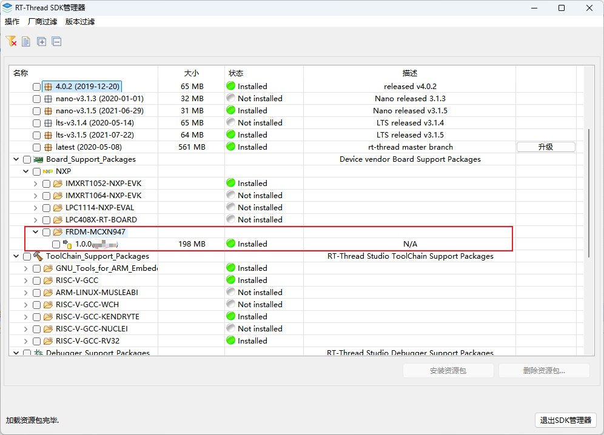
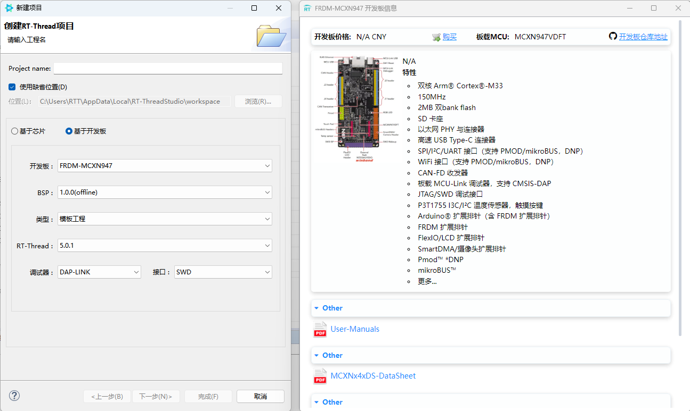
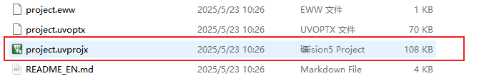
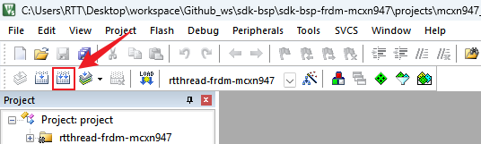
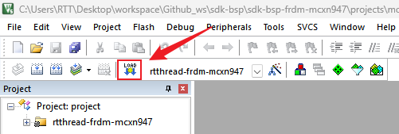

# sdk-bsp-frdm-mcxn947

**English** | [**中文**](./README_zh.md)

## Introduction

**sdk-bsp-frdm-mcxn947** is a support package for the **FRDM-MCXN947** development board, which can also serve as a software SDK for user development, making it easier and more convenient for users to develop their own applications.

The FRDM-MCXN947 is NXP's official low-cost evaluation board based on the MCXN947 device, which integrates dual Arm Cortex-M33 microcontrollers and a Neural Processing Unit (NPU). The board also features MCU-Link debugger circuits such as the P3T1755DP I3C temperature sensor, TJA1057GTK/3Z CAN PHY, Ethernet PHY, SDHC circuitry (with DNP slot), RGB LEDs, touchpad, Hi-Speed USB circuitry, and buttons. The board provides Arduino expansion, PMOD expansion, MicroBus expansion. Also, it supports camera module and NXP low-cost LCD module PAR-LCD-S035. The on-board MCU-Link debugger is based on LPC55S69 MCU.


## Directory Structure

```
$ sdk-bsp-frdm-mcxn947
├── README.md
├── sdk-bsp-frdm-mcxn947.yaml
├── documents
│   ├── MCXN947-Schematic.pdf
│   └── MCXNx4xDS-DataSheet.pdf
│   ├── User-Manuals.pdf
│   ├── 恩智浦FRDM-MCX974实践指南.pdf
├── libraries
│   ├── drivers
├── projects
│   ├── mcxn947_template
│   ├── mcxn947_basic_rtc
│   ├── mcxn947_blink_led
│   ├── mcxn947_driver_adc
│   ├── mcxn947_driver_dac
│   ├── mcxn947_pwm
│   ├── mcxn947_i2c_ssd1306
│   ├── mcxn947_component_flash_fs
└── rt-thread
```

- sdk-bsp-frdm-mcxn947.yaml：Describes the hardware information of the EtherKit. FRDM-MCXN947.
- documents：Schematics, documents, images, datasheets, etc., related to the development board.
- libraries ：General peripheral drivers for FRDM-MCXN947.
- projects：The sample project folder contains template projects and some sample projects.
- rt-thread： Source code of RT-Thread.

## 使用方式

`sdk-bsp-frdm-mcxn947` supports **RT-Thread Studio** and **MDK** development methods.

## **RT-Thread Studio **Development Steps

1. Open RT-Thread Studio and install the FRDM-MCXN947 support package (if a newer version is available, it is recommended to install the latest version; the version shown in the image is for reference only).



2. Create a new FRDM-MCXN947 project by selecting File -> New -> RT-Thread Project -> Based on Development Board. You can create example projects and template projects.

3. Compile and download the project:


## MDK Development Steps

1. Double-click the `mklinks.bat` file. After executing the script, it will generate two folders: `rt-thread` and `libraries`.


*Note:If the `mklinks` script cannot be executed, you will need to manually copy the `rt-thread` and `libraries` folders from the `sdk-bsp-rzn2l-etherkit` directory into your project directory.*

2. Double-click the **project.uvprojx** file to open the IAR project.



3. Click the button below to perform a full project compilation:



4. Click the button below to program the firmware：

