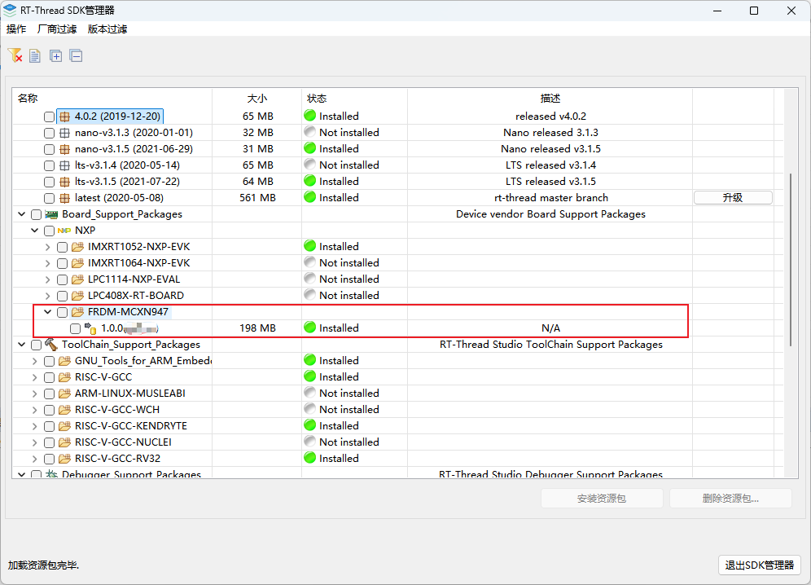
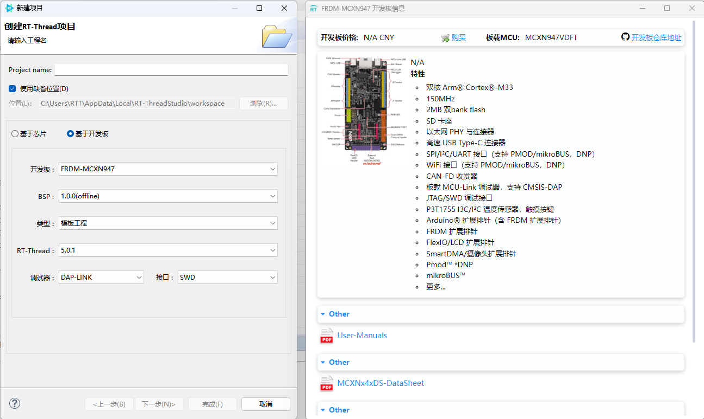
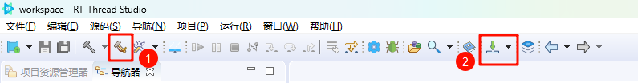
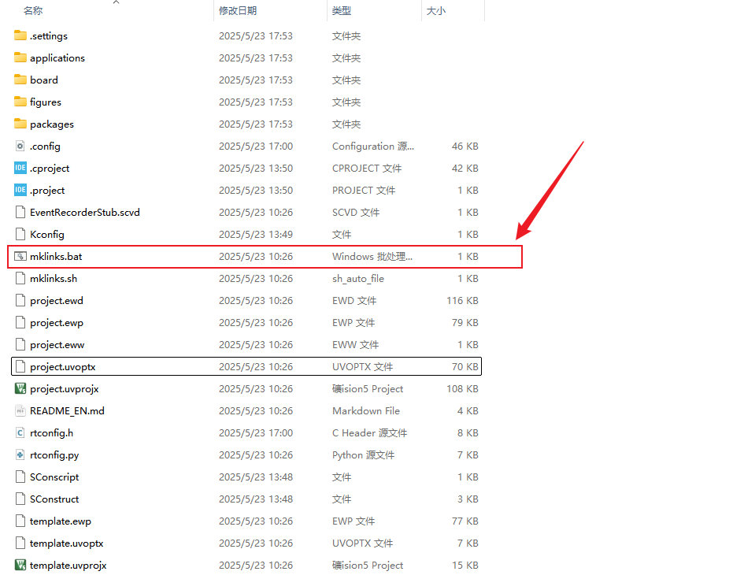
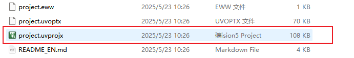
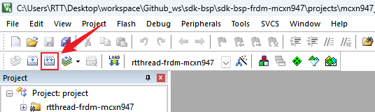
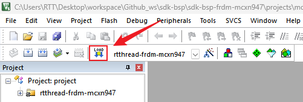

# sdk-bsp-frdm-mcxn947

**中文** | [**English**](./README.md)

## 简介

**sdk-bsp-frdm-mcxn947** 是对 `FRDM-MCXN947`  开发板所作的支持包，也可作为用户开发使用的软件SDK，让用户可以更简单方便的开发自己的应用程序。

FRDM-MCXN947 是 NXP 官方推出的低成本评估板，基于 MCXN947 器件，集成了双 Arm Cortex-M33 微控制器和一个神经网络处理单元（NPU）。该开发板还配备了 MCU-Link 调试电路，包括 P3T1755DP I3C 温度传感器、TJA1057GTK/3Z CAN PHY、以太网 PHY、SDHC 电路（带 DNP 卡槽）、RGB LED、触摸板、高速 USB 电路 和按键。板载提供 Arduino 扩展接口、PMOD 扩展接口 和 MicroBus 扩展接口，同时支持摄像头模块以及 NXP 的低成本 LCD 模块 PAR-LCD-S035。板载 MCU-Link 调试器 基于 LPC55S69 MCU 实现。


## 目录结构

```
$ sdk-bsp-frdm-mcxn947
├── README.md
├── sdk-bsp-frdm-mcxn947.yaml
├── documents
│   ├── MCXN947-Schematic.pdf
│   └── MCXNx4xDS-DataSheet.pdf
│   ├── User-Manuals.pdf
│   ├── 恩智浦FRDM-MCX974实践指南.pdf
├── libraries
│   ├── drivers
├── projects
│   ├── mcxn947_template
│   ├── mcxn947_basic_rtc
│   ├── mcxn947_blink_led
│   ├── mcxn947_driver_adc
│   ├── mcxn947_driver_dac
│   ├── mcxn947_pwm
│   ├── mcxn947_i2c_ssd1306
│   ├── mcxn947_component_flash_fs
└── rt-thread
```

- sdk-bsp-frdm-mcxn947.yaml：描述 FRDM-MCXN947 的硬件信息
- documents：开发板原理图，文档，图片以及 datasheets 等
- libraries ：FRDM-MCXN947 通用外设驱动
- projects：示例工程文件夹，包含模板工程以及一些示例工程
- rt-thread： rt-thread 源码

## 使用方式

`sdk-bsp-frdm-mcxn947` 支持 **RT-Thread Studio** 和 **MDK** 开发方式

## RT-Thread Studio 开发步骤

1. 打开RT-Thread Studio ，安装 FRDM-MCXN947 开发板支持包（如有最新建议安装最新版本，下图版本仅供参考）



2. 新建 FRDM-MCXN947 工程，选择左上角文件->新建->RT-Thread 项目->基于开发板，可以创建示例工程和模板工程



3. 进行工程的编译和下载：



## MDK开发步骤

1. 双击 mklinks.bat 文件，执行脚本后会生成 rt-thread、libraries 两个文件夹：



**注意：如果无法执行mklinks脚本，需要手动将 `sdk-bsp-frdm-mcxn947` 目录下的 rt-thread、libraries 两个文件夹手动拷贝到工程目录**

2. 双击 **project.uvprojx** 文件打开MDK工程



3. 点击下图按钮进行项目全编译：



4. 点击下图按钮进行固件烧录：

