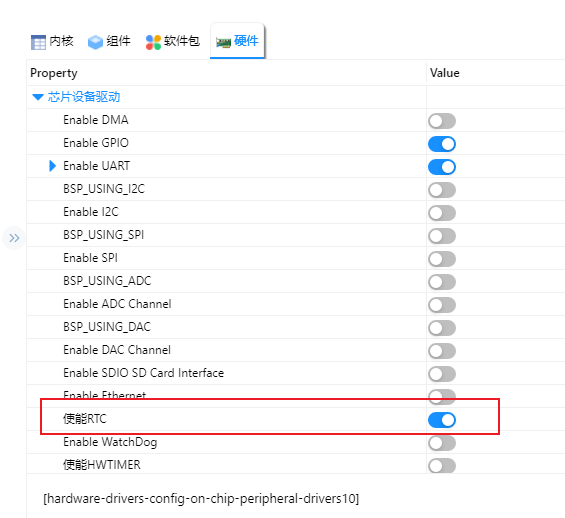

# NXP FRDM-MCXN947 开发板 RTC 示例说明

## 简介

本例程主要介绍了如何在**FRDM-MCXN947**上使用**RTC**（Real-Time Clock）实时时钟，RTC 可以提供精确的实时时间，它可以用于产生年、月、日、时、分、秒等信息。目前实时时钟芯片大多采用精度较高的晶体振荡器作为时钟源。有些时钟芯片为了在主电源掉电时还可以工作，会外加电池供电，使时间信息一直保持有效。

RT-Thread 的RTC 设备为操作系统的时间系统提供了基础服务。面对越来越多的IoT 场景，RTC 已经成为产品的标配，甚至在诸如SSL 的安全传输过程中，RTC 已经成为不可或缺的部分。

## 硬件说明

本例程使用的RTC 设备依赖于LSE 时钟，此外无需过多连接。

## RT-Thread Settings配置

打开RT-Thread Settings，找到硬件选项，使能RTC；



## 示例代码

```c
#include <rtdevice.h>
#include <rtthread.h>
#include "drv_pin.h"

#define LEDB_PIN        ((0*32)+10)
#define RTC_NAME       "rtc"

static int rtc_test(int argc, char *argv[])
{
    rt_err_t ret = RT_EOK;
    time_t now;
    rt_device_t device = RT_NULL;
    /*寻找设备*/
    device = rt_device_find(RTC_NAME);
    if (!device)
    {
    return RT_ERROR;
    }
    /*初始化RTC设备*/
    if(rt_device_open(device, 0) != RT_EOK)
    {
    return RT_ERROR;
    }
    /* 设置日期 */
    ret = set_date(2024, 4, 6);
    if (ret != RT_EOK)
    {
        rt_kprintf("set RTC date failed\n");
        return ret;
    }
    /* 设置时间 */
    ret = set_time(15, 22, 30);
    if (ret != RT_EOK)
    {
        rt_kprintf("set RTC time failed\n");
        return ret;
    }
    /* 延时3秒 */
    rt_thread_mdelay(3000);
    /* 获取时间 */
    now = time(RT_NULL);
    rt_kprintf("%s\n", ctime(&now));
    return ret;
}
/* 导出到 msh 命令列表中 */
MSH_CMD_EXPORT(rtc_test, rtc test);

int main(void)
{
#if defined(__CC_ARM)
    rt_kprintf("using armcc, version: %d\n", __ARMCC_VERSION);
#elif defined(__clang__)
    rt_kprintf("using armclang, version: %d\n", __ARMCC_VERSION);
#elif defined(__ICCARM__)
    rt_kprintf("using iccarm, version: %d\n", __VER__);
#elif defined(__GNUC__)
    rt_kprintf("using gcc, version: %d.%d\n", __GNUC__, __GNUC_MINOR__);
#endif
    rt_pin_mode(LEDB_PIN, PIN_MODE_OUTPUT);  /* Set GPIO as Output */
    rt_kprintf("RTC Alarm2 for NXP MCXN947 Review\r\n");
#ifdef RT_USING_SDIO
    rt_thread_mdelay(2000);
    if (dfs_mount("sd", "/", "elm", 0, NULL) == 0)
    {
        rt_kprintf("sd mounted to /\n");
    }
    else
    {
        rt_kprintf("sd mount to / failed\n");
    }
#endif
    while (1)
    {
        rt_pin_write(LEDB_PIN, PIN_HIGH);    /* Set GPIO output 1 */
        rt_thread_mdelay(500);               /* Delay 500mS */
        rt_pin_write(LEDB_PIN, PIN_LOW);     /* Set GPIO output 0 */
        rt_thread_mdelay(500);               /* Delay 500mS */
    }
}
// end file
```

## 编译&下载

* RT-Thread Studio：在RT-Thread Studio 的包管理器中下载FRDM-MCXN947 资源包，然后创建新工程，执行编译。

* MDK：首先双击mklinks.bat，生成rt-thread 与libraries 文件夹链接；再使用Env 生成MDK5工程；最后双击project.uvprojx打开MDK工程，执行编译。

编译完成后，将开发板的CMSIS-DAP接口与PC 机连接，然后将固件下载至开发板。(连接如下图)


## 运行

将开发板对应的串口与PC相连，在串口工具中打开对应的串口（115200-8-1-N），复位设备。则显示RT-Thread的输出信息，输入rtc_test，三秒后输出 Sat Apr  6 15:22:33 2024。

```bash
 \ | /
- RT -     Thread Operating System
 / | \     5.0.1 build May 26 2025 18:22:55
 2006 - 2022 Copyright by RT-Thread team
using gcc, version: 10.2
RTC Alarm2 for NXP MCXN947 Review
msh >rtc_test
Sat Apr  6 15:22:33 2024
```

