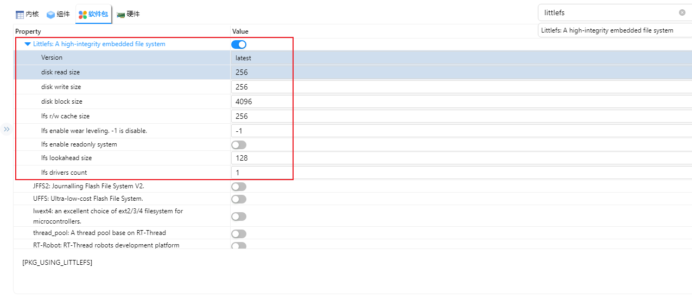

# NXP FRDM-MCXN947 开发板 mflash_fs示例说明

## 简介

本例程划分片上的2Mflash 资源0-1M留给rt-thread使用，1-2M 的空间用于适配MTD设备管理，并在此基础上适配littlefs文件系统用于管理flash空间。

## 硬件说明

**FRDM-MCXN947 片上 Flash** 是 MCU 内部的非易失性存储器，直接映射在 MCU 的地址空间内，通过 **CPU 总线（AHB 总线）** 直接访问，无需额外通信接口（如 SPI、I2C）。

## RT-Thread Settings配置

打开RT-Thread Settings，找到硬件选项，使能mflash driver、RTC；


再找到软件包，选择 littlefs 软件包；



使用littlefs 需要依赖DFS，在组件内开启DFS配置。


## 示例代码

挂载文件系统；

```c
#if defined(BSP_USING_MFLASH) && defined(PKG_USING_LITTLEFS)
#include <dfs_fs.h>
#include <dfs_file.h>
#define DBG_TAG "app.filesystem"
#define DBG_LVL DBG_INFO
#include <rtdbg.h>

static int littlefs_mount(void)
{
    if(rt_device_find("mflash") == RT_NULL)
    {
        return -RT_EIO;
    }

    int ret = dfs_mount("mflash", "/", "lfs", 0, 0);
    
    if (ret != 0)
    {
        rt_kprintf("ret: %d\n",ret);
        LOG_E("mflash mount to '/' failed!");
        
        ret = dfs_mkfs("lfs","mflash");
        if(ret != 0)
          return ret;

        ret = dfs_mount("mflash", "/", "lfs", 0, 0);
        if(ret != 0)
          return ret;
    }

    return RT_EOK;
}
INIT_ENV_EXPORT(littlefs_mount);
```

## 编译&下载

* RT-Thread Studio：在RT-Thread Studio 的包管理器中下载FRDM-MCXN947 资源包，然后创建新工程，执行编译。

* MDK：首先双击mklinks.bat，生成rt-thread 与libraries 文件夹链接；再使用Env 生成MDK5工程；最后双击project.uvprojx打开MDK工程，执行编译。

编译完成后，将开发板的CMSIS-DAP接口与PC 机连接，然后将固件下载至开发板。(连接如下图)


## 运行效果

将开发板对应的串口与PC相连，在串口工具中打开对应的串口（115200-8-1-N），复位设备。输入文件系统命令进行查看目录以及创建文件、查看文件内容。

```bash
 \ | /
- RT -     Thread Operating System
 / | \     5.0.1 build May 26 2025 17:48:22
 2006 - 2022 Copyright by RT-Thread team
using gcc, version: 10.2
MCXN947 Hello
msh />ls
Directory /:
msh />df
disk free: 1000.0 KB [ 125 block, 8192 bytes per block ]
msh />echo 123 a.txt
msh />ls
Directory /:
a.txt               3
msh />cat a.txt
123
msh />
```

