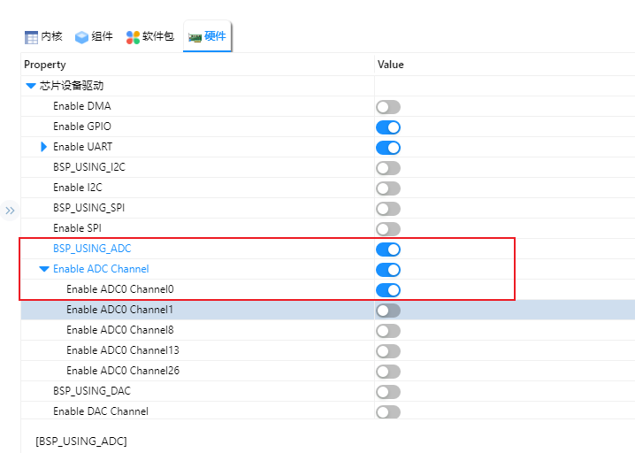

# NXP FRDM-MCXN947 开发板 ADC 示例说明

## 简介

**FRDM-MCXN947** 开发板基于 **NXP MCXN947** 微控制器，内部集成了多通道 **ADC（Analog-to-Digital Converter，模数转换器）** 模块，能够将模拟信号转换为数字信号，广泛应用于传感器数据采集、电压检测、音频输入等模拟量读取场景。

本例程作为SDK 的 ADC 例程，它的主要功能是利用 ADC 将模拟电压转换为数字信号，并从串口打印读取的信号值。

## 硬件说明

硬件中将ADC0_A0跳接至GND、VCC， 对比读取的信号值。


## RT-Thread Settings配置

打开RT-Thread Settings，找到硬件选项，使能ADC0_A0。



## 示例代码

```c
#include <rtdevice.h>

#define ADC_DEV_NAME "adc0"
#define REFER_VOLTAGE 3300 // max adc voltage is 3.3V
#define CONVERT_BITS (1 << 16)  // 16bit adc0

void adc_test(int argv, char **argc) 
{
  rt_adc_device_t adc_dev;
  rt_uint32_t value, vol;
  rt_err_t ret = RT_EOK;

  adc_dev = (rt_adc_device_t)rt_device_find(ADC_DEV_NAME);

  if (adc_dev == RT_NULL) 
  {
    rt_kprintf("adc_test failed! can't find %s device!\n", ADC_DEV_NAME);
    return;
  }

  ret = rt_adc_enable(adc_dev, 0);

  while (1) 
  {
    value = rt_adc_read(adc_dev, 0);
    vol   = value * REFER_VOLTAGE / CONVERT_BITS;
    rt_kprintf("the voltage is :[%d.%03d]V \n", vol / 1000, vol % 1000);
    rt_thread_delay(2000);
  }
  return;
}
MSH_CMD_EXPORT(adc_test, ADC test)
```

## 编译&下载

* RT-Thread Studio：在RT-Thread Studio 的包管理器中下载FRDM-MCXN947 资源包，然后创建新工程，执行编译。

* MDK：首先双击mklinks.bat，生成rt-thread 与libraries 文件夹链接；再使用Env 生成MDK5工程；最后双击project.uvprojx打开MDK工程，执行编译。

编译完成后，将开发板的CMSIS-DAP接口与PC 机连接，然后将固件下载至开发板。(连接如下图)


## 运行效果

将开发板对应的串口与PC相连，在串口工具中打开对应的串口（115200-8-1-N），复位设备。输入adc_test。ADC0_A0跳接至GND时，读取值为0v，ADC0_A0跳接至VCC时，读取值为3.3v.

```bash
 \ | /
- RT -     Thread Operating System
 / | \     5.0.1 build May 26 2025 17:17:20
 2006 - 2022 Copyright by RT-Thread team
using gcc, version: 10.2
MCXN947 Hello
msh >adc_test
the voltage is :[0.000]V
the voltage is :[0.000]V
the voltage is :[0.000]V
the voltage is :[3.299]V
the voltage is :[3.299]V
the voltage is :[3.298]V
```
