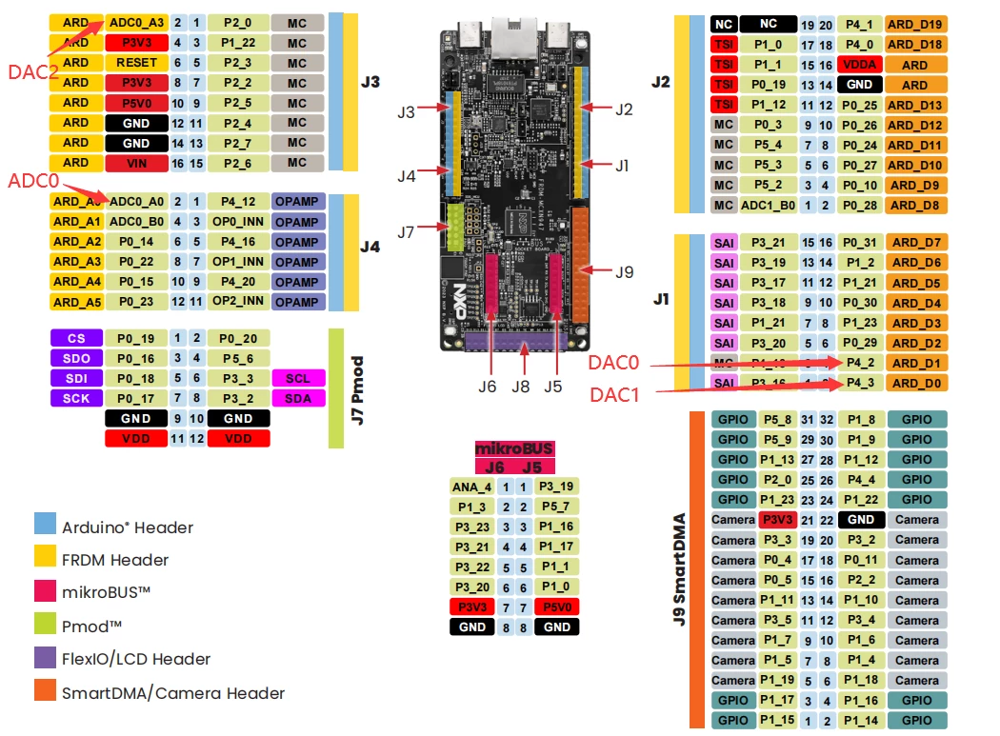
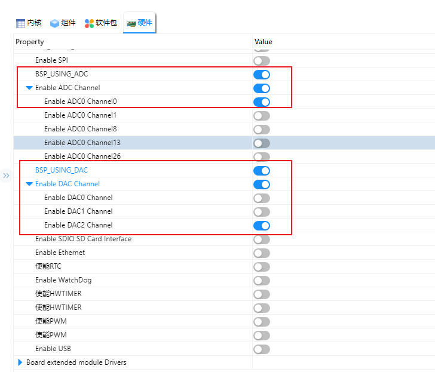
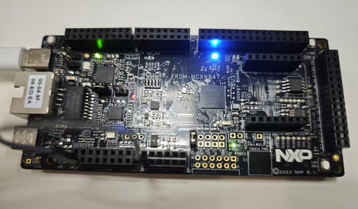

# NXP FRDM-MCXN947 开发板 DAC 示例说明

## 简介

**FRDM-MCXN947** 开发板基于 **NXP MCXN947** 微控制器，内部集成了 **DAC（Digital-to-Analog Converter，数模转换器）** 模块，能够将数字信号转换为模拟电压信号，广泛应用于音频输出、电压控制、电流驱动等模拟控制场景。

本例程作为SDK 的 DAC 例程，它的主要功能是利用 DAC 将数字信号转换为模拟电压，再由ADC 将模拟电压转换为数字信号，并从串口打印读取的信号值。

## 硬件说明

硬件中将DAC2跳接至ADC0_A0；



## RT-Thread Settings配置

打开RT-Thread Settings，找到硬件选项，使能ADC0_A0、使能DAC2后保存。



## 示例代码

```c
//无示例代码，使用命令行验证实验。
```

## 编译&下载

* RT-Thread Studio：在RT-Thread Studio 的包管理器中下载FRDM-MCXN947 资源包，然后创建新工程，执行编译。

* MDK：首先双击mklinks.bat，生成rt-thread 与libraries 文件夹链接；再使用Env 生成MDK5工程；最后双击project.uvprojx打开MDK工程，执行编译。

编译完成后，将开发板的CMSIS-DAP接口与PC 机连接，然后将固件下载至开发板。(连接如下图)


## 运行效果

将开发板对应的串口与PC相连，在串口工具中打开对应的串口（115200-8-1-N），复位设备。根据下面输入命令。

```bash
 \ | /
- RT -     Thread Operating System
 / | \     5.0.1 build May 26 2025 17:00:53
 2006 - 2022 Copyright by RT-Thread team
using gcc, version: 10.2
MCXN947 Hello
msh >adc probe adc0
probe adc0 success
msh >adc enable adc0
adc0 channel 0 enables success
msh >adc read 0
adc0 channel 0  read value is 0x0000DBD7
msh >dac probe dac2
probe dac2 success
msh >dac enable dac2
dac2 channel 0 enables success
msh >dac write 0 20
dac2 channel 0 write value is 20
msh >adc read 0
adc0 channel 0  read value is 0x000000B3
msh >adc read 0
adc0 channel 0  read value is 0x000000A8
msh >adc read 0
adc0 channel 0  read value is 0x000000AA
msh >dac write 0 10000
dac2 channel 0 write value is 10000
msh >adc read 0
adc0 channel 0  read value is 0x00009C03
msh >adc read 0
adc0 channel 0  read value is 0x00009C0C
msh >
```

连接如下图所示：


