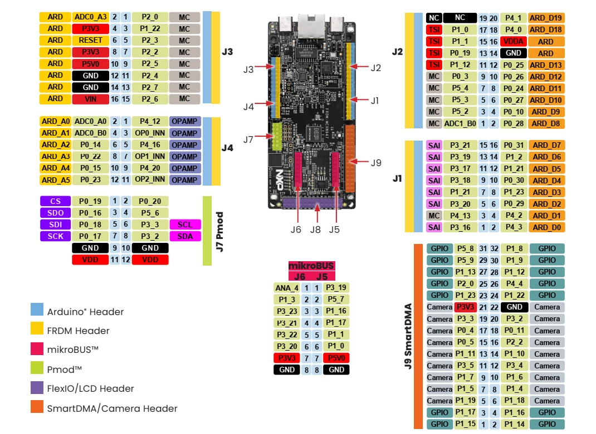

# NXP FRDM-MCXN947 开发板 I2C_SSD1306 示例说明

## 简介

**FRDM-MCXN947** 开发板基于 **NXP MCXN947** 微控制器，集成了多路 **I²C（Inter-Integrated Circuit）** 总线接口，广泛应用于开发板与各类外设之间的短距离串行通信。I²C 总线是一种多主多从的双线通信协议，使用两根信号线（SDA 和 SCL）进行数据传输，具备电路简单、扩展性强、支持多设备挂载等优点。

本例程作为SDK 的 I2C_SSD1306 例程，它的主要功能是利用 I2C 以及 SSD1306 软件包 实现 屏幕显示。

## 硬件说明

本次实验是通过硬件i2c方式来进行通信，硬件i2c采用引脚P0_25 (SCL)和P0_24 (SDA)，位于J2外侧的第7和第5引脚，引脚图参考如下，注意不要接错：


## RT-Thread Settings配置

打开RT-Thread Settings，找到硬件选项，使能 I2C；


再找到软件包，选择sd1306软件包；


## 示例代码

ps: 示例代码用到SSD1306软件包的示例。


## 编译&下载

* RT-Thread Studio：在RT-Thread Studio 的包管理器中下载FRDM-MCXN947 资源包，然后创建新工程，执行编译。

* MDK：首先双击mklinks.bat，生成rt-thread 与libraries 文件夹链接；再使用Env 生成MDK5工程；最后双击project.uvprojx打开MDK工程，执行编译。

编译完成后，将开发板的CMSIS-DAP接口与PC 机连接，然后将固件下载至开发板。(连接如下图)


## 运行效果

将开发板对应的串口与PC相连，在串口工具中打开对应的串口（115200-8-1-N），复位设备。输入ssd1306_TestAll

```bash
 \ | /
- RT -     Thread Operating System
 / | \     5.0.1 build May 26 2025 16:19:22
 2006 - 2022 Copyright by RT-Thread team
I/I2C: I2C bus [i2c1] registered
using gcc, version: 10.2
MCXN947 Hello
msh >ssd
ssd1306_TestAll
msh >ssd1306_TestAll
```

运行结果如下图所示：


