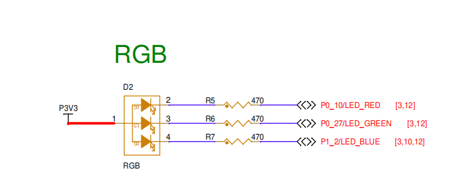
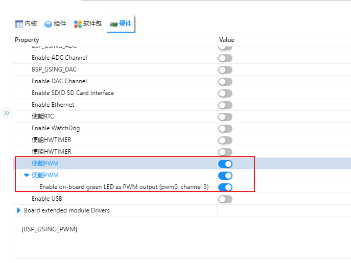
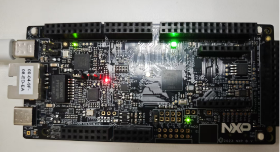

# NXP FRDM-MCXN947 开发板 PWM 示例说明

## 简介

FRDM-MCXN947 开发板基于 NXP MCXN947 微控制器，内部集成了多个灵活配置的定时器模块，可用于生成 PWM（脉宽调制）信号。PWM 是通过控制数字信号在一个周期内高电平所占的时间比例（占空比）来调节模拟信号输出的方法，广泛应用于电机驱动、LED 调光、蜂鸣器控制以及信号调制等场景。

本例程作为SDK 的 PWM 例程，它的主要功能是利用PWM 实现 LED调光，即呼吸灯。

## 硬件说明



如上图所示，FRDM-MCXN947 提供三个用户LED，分别为LED_RED、LED_GREEN、LED_BLUE，其中LED_GREEN对应引脚P0_27。单片机引脚输出低电平即可点亮LED ，输出高电平则会熄灭LED。

## RT-Thread Settings配置

打开RT-Thread Settings，找到硬件选项，使能PWM；



## 示例代码

```c
#include <rtdevice.h>
#include <rtthread.h>
#include "drv_pin.h"

#define LEDG_PIN        ((0*32)+27)   
#define PWM_DEV_NAME     "pwm0"
#define PWM_DEV_CHANNEL    3

struct rt_device_pwm *pwm_dev;

int main(void)
{
#if defined(__CC_ARM)
    rt_kprintf("using armcc, version: %d\n", __ARMCC_VERSION);
#elif defined(__clang__)
    rt_kprintf("using armclang, version: %d\n", __ARMCC_VERSION);
#elif defined(__ICCARM__)
    rt_kprintf("using iccarm, version: %d\n", __VER__);
#elif defined(__GNUC__)
    rt_kprintf("using gcc, version: %d.%d\n", __GNUC__, __GNUC_MINOR__);
#endif

    rt_kprintf("MCXN947 HelloWorld\r\n");

#ifdef RT_USING_SDIO
    rt_thread_mdelay(2000);
    if (dfs_mount("sd", "/", "elm", 0, NULL) == 0)
    {
        rt_kprintf("sd mounted to /\n");
    }
    else
    {
        rt_kprintf("sd mount to / failed\n");
    }
#endif

    rt_uint32_t period = 1000000; /* 1ms,单位ns */
    rt_uint32_t pulse = 0; //占空比
    rt_uint32_t dir = 1; //增长方向
    pwm_dev = (struct rt_device_pwm *)rt_device_find(PWM_DEV_NAME);

    if(pwm_dev == RT_NULL)
    {
        rt_kprintf("pwm test run failed! can't find %s device!\n",PWM_DEV_NAME);
    }

    rt_pwm_set(pwm_dev, PWM_DEV_CHANNEL, period, 0);
    rt_pwm_enable(pwm_dev, PWM_DEV_CHANNEL);
    rt_kprintf("pwm start\r\n");

    while (1)
    {
        rt_thread_mdelay(20);

        if(dir)
        {
            pulse += 10000; /* 从0开始每次增加10000ns */
        }
        else
        {
            pulse -= 10000; /* 从最大值每次减少10000ns */
        }

        if(pulse >= period)
        {
            dir = 0;
        }
        if(pulse == 0)
        {
            dir = 1;
        }
        /* 设置PWM周期和脉冲宽度 */
        rt_pwm_set(pwm_dev, PWM_DEV_CHANNEL, period, pulse);
    }
}
// end file
```

## 编译&下载

* RT-Thread Studio：在RT-Thread Studio 的包管理器中下载FRDM-MCXN947 资源包，然后创建新工程，执行编译。

* MDK：首先双击mklinks.bat，生成rt-thread 与libraries 文件夹链接；再使用Env 生成MDK5工程；最后双击project.uvprojx打开MDK工程，执行编译。

编译完成后，将开发板的CMSIS-DAP接口与PC 机连接，然后将固件下载至开发板。(连接如下图)


## 运行效果

如果没有自动运行，请按复位按钮重新启动开发板，观察开发板上指示灯的实际效果。正常工作后，led会正常呈现呼吸灯样式闪烁，如下图所示：



将开发板对应的串口与PC相连，在串口工具中打开对应的串口（115200-8-1-N），复位设备。则显示RT-Thread的输出信息：

```bash
 \ | /
- RT -     Thread Operating System
 / | \     5.0.1 build May 26 2025 15:39:26
 2006 - 2022 Copyright by RT-Thread team
using gcc, version: 10.2
MCXN947 HelloWorld
pwm start
msh >
```

