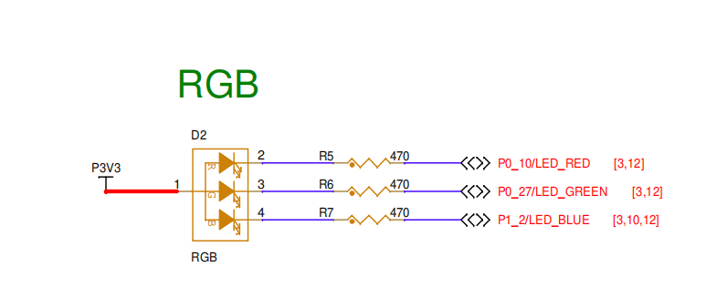
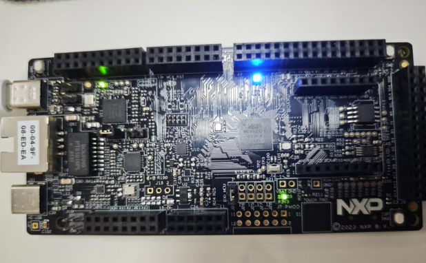

# NXP FRDM-MCXN947 开发板模板工程说明

## 简介

本例程作为SDK 的模板例程，也是最简单的例程，可以在此基础上进行开发。它的主要功能是让板载的RGB-LED 进行周期性闪烁。

## 硬件说明



如上图所示，FRDM-MCXN947 提供三个用户LED，分别为LED_RED、LED_GREEN、LED_BLUE，其中LED_BLUE对应引脚P1_2。单片机引脚输出低电平即可点亮LED ，输出高电平则会熄灭LED。

## 示例代码

```c
#include <rtdevice.h>
#include <rtthread.h>
#include "drv_pin.h"

#define LEDB_PIN        ((1*32)+2)

int main(void)
{
#if defined(__CC_ARM)
    rt_kprintf("using armcc, version: %d\n", __ARMCC_VERSION);
#elif defined(__clang__)
    rt_kprintf("using armclang, version: %d\n", __ARMCC_VERSION);
#elif defined(__ICCARM__)
    rt_kprintf("using iccarm, version: %d\n", __VER__);
#elif defined(__GNUC__)
    rt_kprintf("using gcc, version: %d.%d\n", __GNUC__, __GNUC_MINOR__);
#endif

    rt_pin_mode(LEDB_PIN, PIN_MODE_OUTPUT);  /* Set GPIO as Output */
    rt_kprintf("MCXN947 Hello\n");

#ifdef RT_USING_SDIO
    rt_thread_mdelay(2000);
    if (dfs_mount("sd", "/", "elm", 0, NULL) == 0)
    {
        rt_kprintf("sd mounted to /\n");
    }
    else
    {
        rt_kprintf("sd mount to / failed\n");
    }
#endif

    while (1)
    {
        rt_pin_write(LEDB_PIN, PIN_HIGH);    /* Set GPIO output 1 */
        rt_thread_mdelay(500);               /* Delay 500mS */
        rt_pin_write(LEDB_PIN, PIN_LOW);     /* Set GPIO output 0 */
        rt_thread_mdelay(500);               /* Delay 500mS */
    }
}
// end file
```

## 编译&下载

* RT-Thread Studio：在RT-Thread Studio 的包管理器中下载FRDM-MCXN947 资源包，然后创建新工程，执行编译。

* MDK：首先双击mklinks.bat，生成rt-thread 与libraries 文件夹链接；再使用Env 生成MDK5工程；最后双击project.uvprojx打开MDK工程，执行编译。

编译完成后，将开发板的CMSIS-DAP接口与PC 机连接，然后将固件下载至开发板。(连接如下图)


## 运行

如果没有自动运行，请按复位按钮重新启动单板，观察单板上指示灯的实际效果。正常工作后，led会周期性闪烁，如下图所示：



将开发板对应的串口与PC相连，在串口工具中打开对应的串口（115200-8-1-N），复位设备。则显示RT-Thread的输出信息：

```bash
 \ | /
- RT -     Thread Operating System
 / | \     5.0.1 build May 26 2025 14:20:09
 2006 - 2022 Copyright by RT-Thread team
using gcc, version: 10.2
MCXN947 Hello
msh >
```

